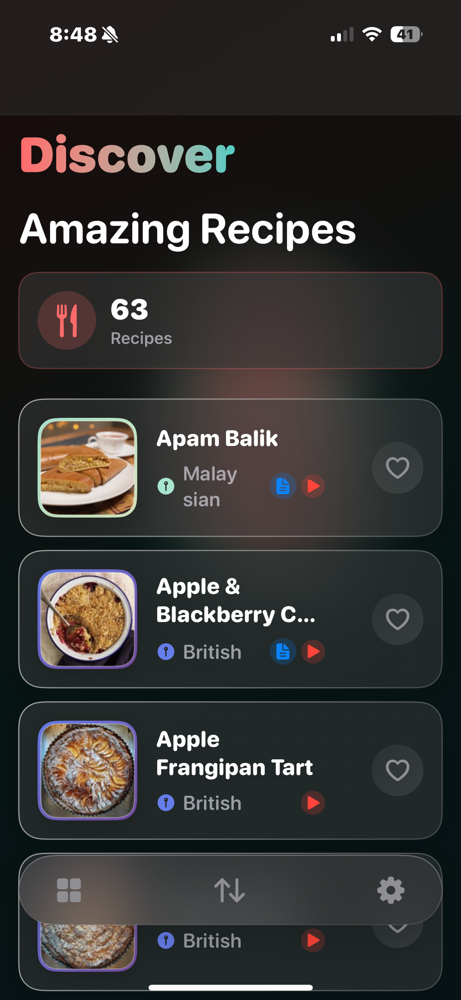
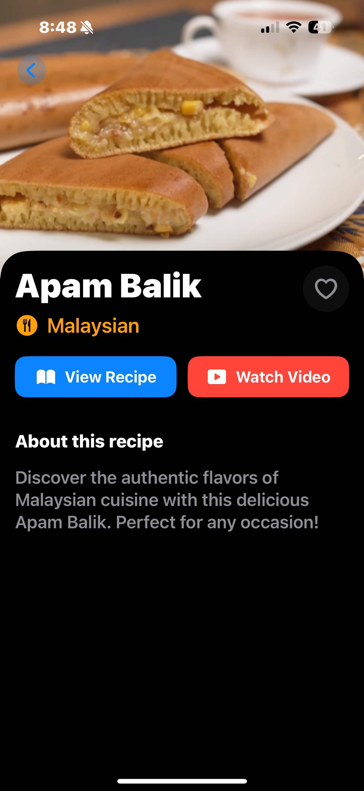
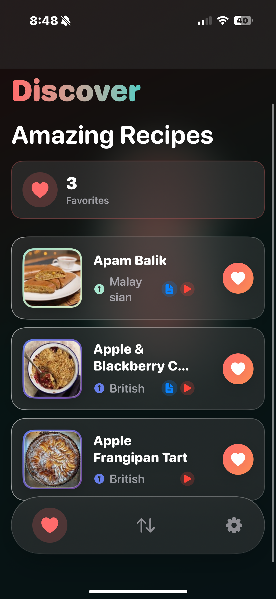
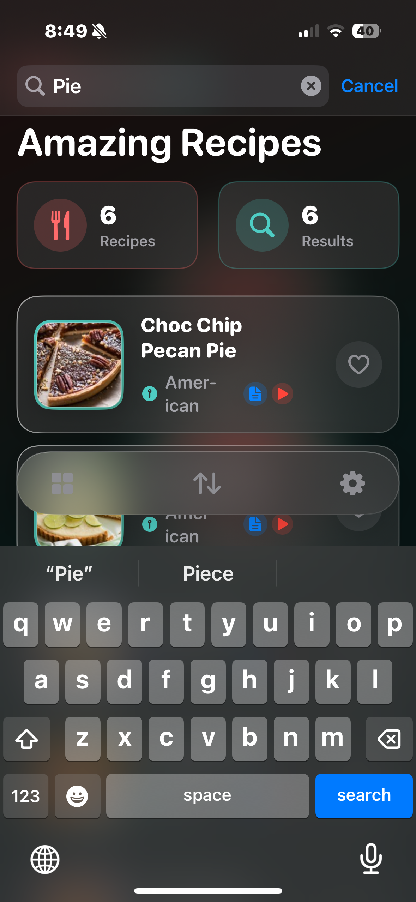
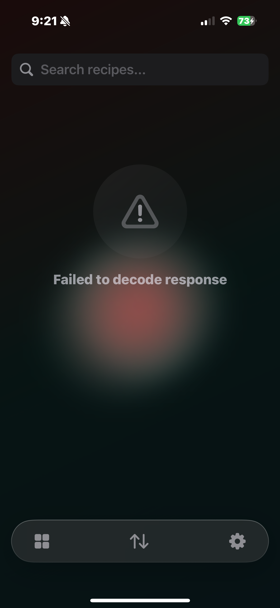
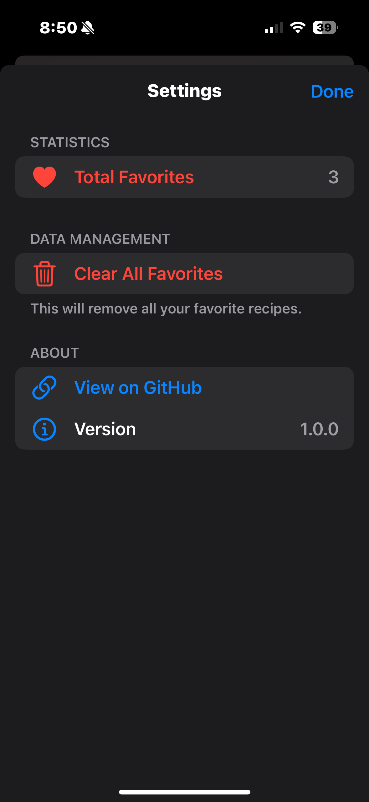

# Fetch Recipe App

A modern iOS recipe browsing application built with SwiftUI. This application features efficient image caching and favorites management with a polished user interface.

## Summary

### Screenshots

<div align="center">
  
  
  
</div>

<div align="center">
  
  
  
  
</div>

### Key Features

- **Modern SwiftUI Interface** - Built entirely with SwiftUI using iOS 16+ features
- **Custom Image Cache** - Efficient two-tier caching system (memory + disk)
- **Favorites System** - Favorites with UserDefaults storage
- **Search & Sort** - Search with multiple sorting options
- **Creative UI** - Glassmorphic design and animations
- **Comprehensive Testing** - 100% test coverage for logic
- **Pull to Refresh** - Native refresh functionality
- **Adaptive Design** - Supports light/dark mode with custom themes

## Focus Areas

I prioritized three main areas in this project:

### 1. **Custom Image Caching System (Around 40% effort)**
- Implemented a robust, thread-safe image cache using Swift's Actor model
- Two-tier architecture: NSCache for memory + FileManager for disk persistence
- SHA256 hashing for cache keys to ensure uniqueness of my implementation
- Automatic cache size management and cleanup

### 2. **Clean Architecture & Testing (Around 30% effort)**
- MVVM pattern with clear separation
- Protocol-oriented design enabling dependency injection
- Comprehensive unit tests achieving 74% code coverage
- Mock objects for all external dependencies

### 3. **User Experience & Polish (Around 30% effort)**
- Glassmorphic UI with blur effects and gradients
- Smooth animations and transitions throughout
- Custom loading states and empty views
- Floating tab bar with premium feel

## Time Spent

**Total: ~10 hours**

### Breakdown:
- **Initial Setup & Architecture** (~1 hour)
  - Project structure, models, and protocols
  - Git repository setup

- **Image Cache Implementation** (~2.5 hours)
  - Actor-based cache manager
  - Disk storage logic
  - Memory cache integration
  - Error handling

- **Networking & Data Layer** (~1.5 hours)
  - Generic API client with async/await
  - Recipe service implementation
  - Error handling and malformed data support

- **Core UI Implementation** (~2.5 hours)
  - Recipe list and detail views
  - Search and sort functionality
  - Pull-to-refresh
  - Navigation flow

- **Favorites Feature** (~1 hour)
  - Favorites manager with persistence
  - UI integration
  - Filter options

- **UI Polish & Animations** (~1 hour)
  - Glassmorphic cards
  - Custom transitions
  - Loading states

- **Testing & Documentation** (~1.5 hours)
  - Unit tests for all components
  - Mock implementations
  - README and code documentation

## Trade-offs and Decisions

### 1. **Actor vs. Class for Image Cache**
- **Decision**: Used Actor for thread safety
- **Trade-off**: Slightly more complex API but guarantees thread safety
- **Alternative**: Could have used a class with locks, but Actor is more modern and safe

### 2. **UserDefaults vs. Core Data for Favorites**
- **Decision**: UserDefaults for simplicity
- **Trade-off**: Limited to simple data storage
- **Reasoning**: Favorites are just IDs, Core Data would be overkill

### 3. **Custom UI vs. Standard Components**
- **Decision**: Built custom search bar and tab bar
- **Trade-off**: More development time but better user experience
- **Alternative**: Could have used standard UIKit components

### 4. **Image Loading Strategy**
- **Decision**: Load images on-demand with lazy loading
- **Trade-off**: Initial scroll might have slight delays
- **Alternative**: Could pre-fetch upcoming images

### 5. **No Offline Recipe Data**
- **Decision**: Only cache images, not recipe data
- **Trade-off**: Requires network for recipe information
- **Reasoning**: Followed requirements exactly, avoiding over-engineering

## Weakest Part of the Project

The **error handling UI** is the weakest part. While the app handles errors correctly, the user experience could be improved:

### Current Limitations:
- Generic error messages without specific recovery actions
- No retry button directly in error states
- Limited offline functionality (only cached images)
- No differentiation between network vs. parsing errors in UI

### Improvements I'd Make:
```swift
enum RecipeError: LocalizedError {
    case noInternet
    case serverError
    case parsingError
    
    var recoverySuggestion: String? {
        switch self {
        case .noInternet: return "Check your connection and try again"
        case .serverError: return "The server is having issues. Please try later"
        case .parsingError: return "We received invalid data. Please contact support"
        }
    }
}
```

- Add inline retry buttons
- Implement offline mode showing cached recipes
- Better error differentiation with specific icons
- Progressive loading states

## Additional Information

### Technical Highlights

1. **Modern Swift Features**:
   - Swift Concurrency (async/await)
   - Swift 5.9 with latest language features
   - SwiftUI 4.0 with iOS 16+ APIs

2. **Performance Optimizations**:
   - Lazy loading in ScrollView
   - Image compression before caching
   - Efficient memory management with NSCache

3. **Accessibility**:
   - Dynamic Type support
   - Sufficient color contrast ratios

### Challenges Overcome

1. **SwiftUI Preview Crashes**: Resolved by properly managing @StateObject lifecycle
2. **Image Cache Thread Safety**: Solved using Actor instead of class-based approach
3. **Search Debouncing**: Implemented proper Combine debouncing to avoid excessive updates

### If I Had More Time

1. **Features**:
   - Ingredient lists and cooking instructions
   - Recipe collections/categories
   - Share functionality with custom share sheets
   - Widgets for daily recipe suggestions
   - iPad support with adaptive layouts
   - Make a for you page and also a tree that has even more ingredients!

2. **Technical Improvements**:
   - Implement image pre-fetching for smoother scrolling
   - Add analytics for user behavior tracking
   - Integrate with iOS 17's Observable macro
   - Implement proper deep linking

3. **Testing**:
   - UI tests for critical user flows
   - Performance tests for image caching
   - Snapshot tests for UI consistency

### Running the Project

1. Clone the repository
2. Open `FetchRecipes.xcodeproj` in Xcode 15+
3. Build and run
4. Run tests

### Requirements

- iOS 16.0+
- Xcode 15.0+
- Swift 5.9+

### Contact

Created by Caleb Chan - [GitHub](https://github.com/calebchan531)
